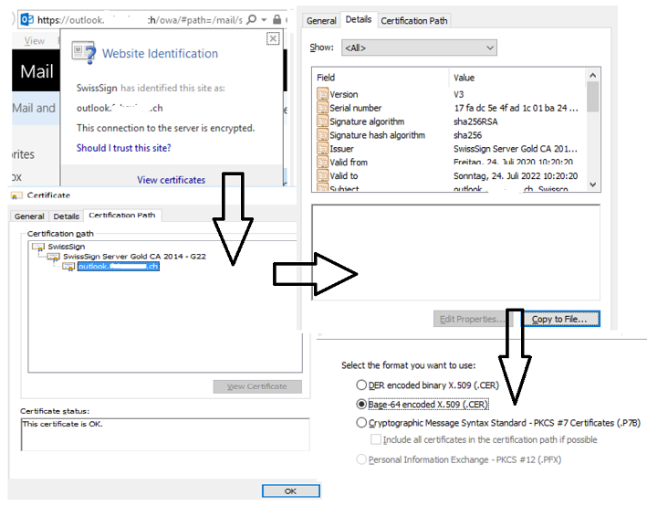
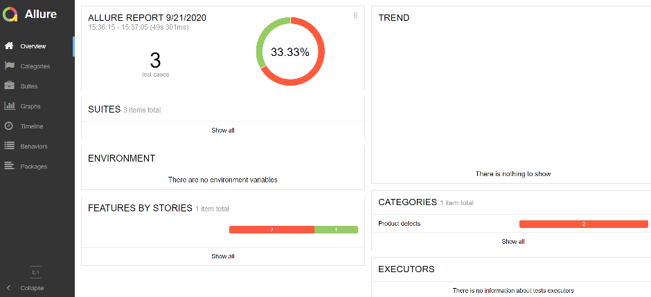
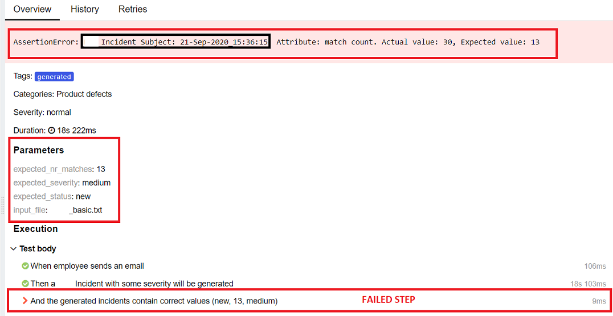
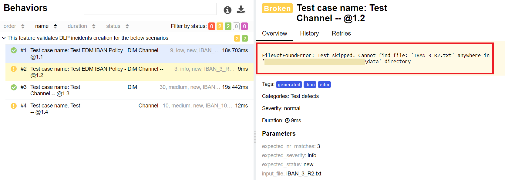
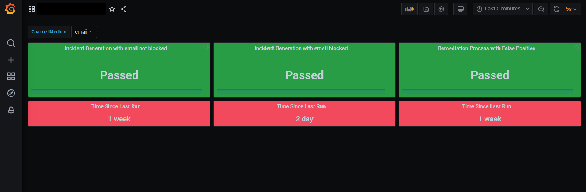

# E2E testing automation tool

This project shows, how to combine different tools and/or libraries in order to write complex E2E tests, which will test your whole system and not only individual parts.
It can be used as a template, where already few integrations are available to be used, like REST calls, DB connections, Selenium, Splunk search and email integration together with Prometheus. 
Source code is written in [Python 3](https://www.python.org/downloads/release/latest), tests are created in form of feature files using [Behave](https://behave.readthedocs.io/en/latest/) framework


 

There is also an integration with Prometheus implemented, ie. you can, if you want push your test results into [Prometheus](https://prometheus.io/docs/introduction/overview/) server and later display those results aka metrics into a monitoring tool like [Grafana](https://grafana.com/docs/grafana/latest/getting-started/what-is-grafana/) 

## Table of Contents
1. [Requirements](#requirements)
2. [Preparing Config file](#preparing-config-file)
3. [Preparing Exchange server certificate](#preparing-exchange-server-certificate)
4. [How to run tests](#how-to-run-tests)  
5. [Running subset of tests](#running-subset-of-tests)
6. [Reporting](#reporting)
7. [Monitoring](#monitoring)
8. [Additional Documentation](#additional-documentation)


### Requirements <a name="requirements"></a>
1. Python 3.7 and higher
2. Config files: 
    * **config.yml** (located in the config dir): stored configuration for the systems under test, like Exchange server, databases, Prometheus etc. (environment specific)
3. Valid credentials for the systems under test, like Exchange server, databases, Prometheus etc.

### Preparing Config file <a name="preparing-config-file"></a>
Configuration file is environment specific and contains information about systems under test.
There is a template file prepared under config/config_template.yml. After opening and updating the template with system specific values, **store the template as "{my_config}.yml"**

By default, config/config.yml configuration file is used. To override this behavior, you have to pass an argument to the test executor like this:
``-D config={config_file_name}``, where "config_file_name" is the name of the file you have created using "config_template.yaml" and stored into config directory.
Example:
```
behave -t=@e2e -D config=my_config --no-skipped -f allure -o allure_reports
```

### Preparing Exchange server certificate <a name="preparing-exchange-server-certificate"></a>
1. Open your webmail url in a browser
2. Click on the site information details (most probably a "lock" icon somewhere next to the url browser component)
3. Click on Certificate -> Details -> Copy to File -> Next -> Base-64 encoded X.509 (.CER) -> Next -> Save
4. Add the certification path into the config file for exchange server (config/config_template.yml)





Troubleshooting:
If the above does not work, try to install the above exported certificate manually:
Follow the last answer from this article: https://stackoverflow.com/questions/34812787/python-ssl-requests-and-lets-encrypt-certs

If that also does not help, create a certificate chain manually form all certificates
 present in the certification path of the certificate you have generated: https://support.dvsus.com/hc/en-us/articles/212924086-Creating-a-Full-Certificate-PEM-Chain
 
### How to run tests <a name="how-to-run-tests"></a>
```
#clone the project and switch to the project root dir
git clone {this_repo}
cd blackbox_test_framework

#install dependencies needed to run tests
pip install -r requirements.txt  

#run tests with desired tags (set of tests) and generate a report
behave -t=@e2e -D config=my_config --no-skipped -f allure -o allure_reports

#generate test report locally
python allure_report_generator.py

```

#### Running subset of tests <a name="running-subset-of-tests"></a>
With Behave framework, user can define what subset of tests will be run by providing a tag to the test runner. Detailed usage of using this feature of Behave framework can be found on [Behave Tags](https://behave.readthedocs.io/en/latest/gherkin.html#tags)  
In the current project, there is at the moment one tag defined with a special meaning.
- @monitoring - results of test cases with these tags will be send to Prometheus for monitoring purposes  

Other kind of tags and test grouping is solely in competence of the respective tester. These tags can be defined when specifying test cases under "tags" attribute.


### Reporting <a name="reporting"></a>

- Test reports are stored in allure_reports directory. Those are json files describing individual test runs
- Final test report is generated after running allure_report_generator in allure-report directory. That report can be later opened in any browser on your local machine
    
  
  You can also see detailed information about failed tests, such as subject of the email to look for in DLP and what parameters have been passed to the test, example:
  
  
- In case there are some testing data missing in test data directory, test won't be marked as failed. Instead, the test will be marked as "Broken" with details about the file which is missing:
  
  
### Monitoring <a name="monitoring"></a>

As mentioned in "Running subset of tests" section, there is a @monitoring tag available in case test results should be pushed to Prometheus. In this case the tests can be used in any pipeline to run frequently and guarantee, that the system under test is available and functioning.
Example of Grafana report based on these tests:


### Creation of Cronjobs/Scheduled Tasks
The script create_cron_job.py allows you to create cronjob (on linux) / scheduled task (on windows systems) which will execute the behave command in regular intervals.

Requirements: python

#### Usage

```sh
usage: create_cron_job.py [-h] [-i INTERVAL] [-c CONFIG] [-r] directory

positional arguments:
  directory

optional arguments:
  -h, --help            show this help message and exit
  -i INTERVAL, --interval INTERVAL
                        Interval between each execution in minutes (default: 15)
  -c CONFIG, --config CONFIG
                        Path to the configfile to be used (default: config)
  -r, --replace         Replace existing cronjobs (default: false)
```

Warning: Using -r on linux systems will remove all the existing cronjobs for the current user! 

You can see the currently active cronjobs with `crontab -l`
#### Example Usage
```sh
python create_cron_job.py -i 30 C:\Temp\myproject
```

This will create a new cronjob which is executed once every 30 minutes.